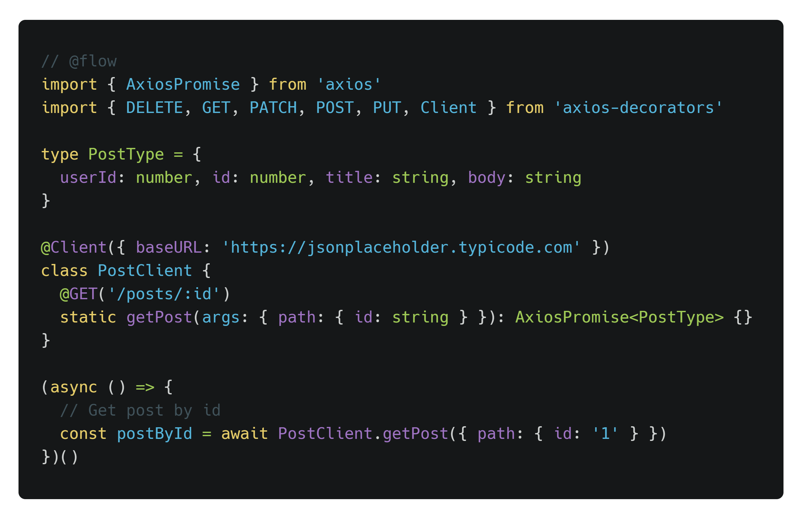

# Axios Decorators
[](https://standardjs.com)
[](https://sonarcloud.io/dashboard?id=FriendsOfReact_axios-decorators)
[](https://www.npmjs.com/package/axios-decorators)

It is an HTTP client library that uses Axios and JavaScript decorators. It is inspired by the popular Android library [Retrofit](https://github.com/square/retrofit). 

<p align="center">
    
</p>

## Dependencies
The main dependency is Babel, it uses decorators and classes to make JavaScript developers' life easier. Hence there are two dependencies as [plugin-proposal-decorators](https://babeljs.io/docs/en/babel-plugin-proposal-decorators) and [plugin-proposal-class-properties](https://babeljs.io/docs/en/babel-plugin-proposal-class-properties).

Axios and Regenerator are other dependencies, you can find dependency installation in the following section.

## Installation

### Babel Core
First of all, Babel has to be installed, but if you have already Babel on your project, you can skip this part. Babel installation can differ by application. Please check the [Babel's documentation](https://babeljs.io/setup) for detailed information.  

### Babel Plugins

```
npm install --save-dev @babel/plugin-proposal-class-properties @babel/plugin-proposal-decorators
```

After plugin installation, following configuration have to be added to `.babelrc` file.

```
{
  "presets": [...],
  "plugins": [
    [
      "@babel/plugin-proposal-decorators",
      {"legacy": true}
    ],
    ["@babel/plugin-proposal-class-properties"]
  ]
}
```

### Runtime Regenerator 
If you already use [@babel/polyfill](https://babeljs.io/docs/en/babel-polyfill), you can skip this part. However, `@babel/polyfill` has been deprecated, upgrading the project to `core-js` and `regenerator` is suggested.

```
npm install --save regenerator
```

### Flow
[Flow](https://flow.org/en/docs/install/) is suggested to get auto-suggestion support on the IDE. 

```
npm install --save-dev @babel/core @babel/cli @babel/preset-flow
```

After installation, Flow's preset has to be added to `.babelrc` file.

```
{
  "presets": ["@babel/preset-flow"]
}
```

### Axios & Axios Decorators

```
npm install --save axios axios-decorators
```

## Usage Examples

### Basic
You can access the basic example's code from [this link](examples/basic).
```javascript
// @flow
import { AxiosPromise } from 'axios'
import { DELETE, GET, PATCH, POST, PUT, Client } from 'axios-decorators'

type PostType = {
  userId: number;
  id: number;
  title: string;
  body: string;
}

@Client({ baseURL: 'https://jsonplaceholder.typicode.com' })
class PostClient {
  @GET('/posts')
  static getPostList (): AxiosPromise<PostType> {}

  @GET('/posts/:id')
  static getPost (args: { path: { id: string } }): AxiosPromise<PostType> {}

  @POST('/posts')
  static createPost (args: { data: PostType }): AxiosPromise<PostType> {}

  @PUT('/posts/:id')
  static putPost (args: { path: { id: string }, data: PostType }): AxiosPromise<PostType> {}

  @PATCH('/posts/:id')
  static patchPost (args: { path: { id: string }, data: PostType }): AxiosPromise<PostType> {}

  @DELETE('/posts/:id')
  static deletePost (args: { path: { id: string } }): AxiosPromise<PostType> {}
}


(async () => {
  // Get post list
  const postList = await PostClient.getPostList()

  // Get post by id
  const postById = await PostClient.getPost({ path: { id: '1' } })

  // Create a post
  const createPost = await PostClient.createPost({
    data: {
      userId: 1,
      title: 'Post title',
      body: 'Post body'
    }
  })

  // Put data to the post
  const putPost = await PostClient.putPost({
    path: {
      id: '1'
    },
    data: {
      userId: 2,
      title: 'Modified post title',
      body: 'Modified post body'
    }
  })

  // Patch the post
  const patchPost = await PostClient.patchPost({
    path: {
      id: '1'
    },
    data: {
      body: 'Modified post body for patch'
    }
  })

  // Delete the post
  const deletePost = await PostClient.deletePost({
    path: {
      id: '1'
    }
  })
})()
```

### Micro Services (like Feign)

```javascript
// flow
import { AxiosPromise } from 'axios'
import { GET, Client, ClientConfigurator } from 'axios-decorators'

// Assume that this map is generated using consul service info
const serviceMap = {
    PostService: 'http://172.0.0.1',
    CommentService: 'http://172.0.0.2'
}

ClientConfigurator.setBaseURL((serviceName) => {
    // Service name is used to get service URL
    return serviceMap[serviceName]
})

// Client definitions
@Client({ name: 'PostService', basePath: '/post' })
class PostClient {
  @GET('/posts')
  static getPostList (): AxiosPromise<PostType> {}
}

@Client({ name: 'CommentService', basePath: '/comment' })
class CommentClient {
  @GET('/comments')
  static getCommentList (): AxiosPromise<CommentType> {}
}
```

## Reference

### ClientConfigurator
It stores client configurations.

#### ClientConfigurator.setBaseURL

```javascript
// flow
ClientConfigurator.setBaseURL(baseURL: string | ((serviceName: string) => void))
```

|Property|Description|Type|
|---|---|---|
|baseURL|It is global Base URL.|string  &#124; ((serviceName: string) => void)|

#### ClientConfigurator.setHeaders

```javascript
// flow
ClientConfigurator.setBaseURL(headers: object | ((serviceName: string) => void))
```

|Property|Description|Type|
|---|---|---|
|headers|It is global headers value.|object  &#124; ((serviceName: string) => void)|

### Decorators
#### @Client
It is used to define client class.

```javascript
// flow
Client(name?: string);
```

|Property|Description|Type|
|---|---|---|
|options.name|It is distinctive feature of the client class. It could be used to find service's IP address.|string|

```javascript
// flow
Client(options?: { name?: string; baseURL?: string; basePath?: string; });
```

|Property|Description|Type|
|---|---|---|
|options.name|It is distinctive feature of the client class. It could be used to find service's IP address.|string|
|options.baseURL|Base URL of the API can be changed directly using this parameter. It overrides baseURL coming from ClientConfigurator.|string|
|options.basePath|It is common path of the service.|string|

#### Methods (@GET, @POST, @PUT, @PATCH, @DELETE)

```javascript
// flow
type MethodOptions = {
    headers?: object | (() => object);
};

GET(endpoint: string, methodOptions?: MethodOptions);
POST(endpoint: string, methodOptions?: MethodOptions);
PUT(endpoint: string, methodOptions?: MethodOptions);
PATCH(endpoint: string, methodOptions?: MethodOptions);
DELETE(endpoint: string, methodOptions?: MethodOptions);
```

|Property|Description|Type|
|---|---|---|
|endpoint|This is specific path of your controller.|string|
|methodOptions.headers|Headers of the request.|object &#124; function|